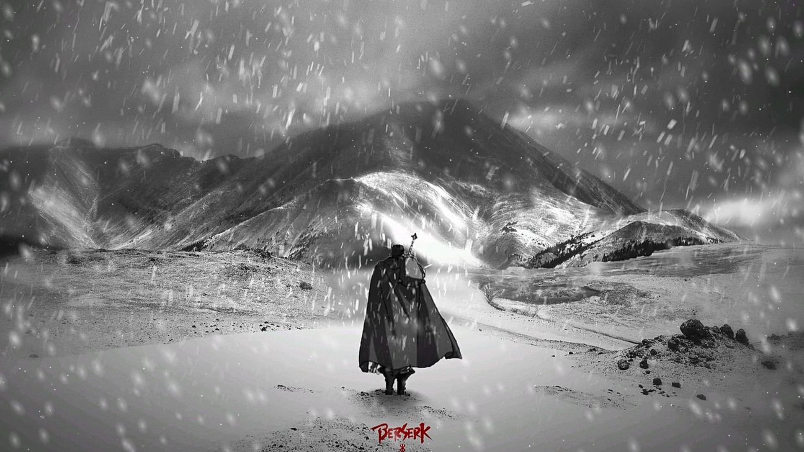

# Berserk Snow ❄️🗡️

Guts in a blizzard — a **4K Berserk image** brought to life with realistic
falling snow (depth-of-field, motion blur, gusting wind), drifting mist,
vignette and film grain. Renders at your screen's native resolution.

## 👉 The wallpaper is **`Berserk-Snow.html`**

(Renamed from `index.html` so it's unmistakably the new version.)

| File | What it's for |
|------|---------------|
| **`Berserk-Snow.html`** | **The wallpaper. Open/import this one.** |
| `bg.jpg` | The 4K Berserk image (upright, 16:9) |
| `LivelyProperties.json` / `project.json` | Settings panels |
| `preview.jpg` | Thumbnail |

## See it right now (in your browser)

👉 https://htmlpreview.github.io/?https://github.com/niqhttime9990/claude/blob/main/Berserk-Snow.html

It pulls the 4K image straight from GitHub, so it works even without the local
file. (Move your mouse for a little parallax.)

## Set it as your Windows wallpaper (Lively — free)

> **If you already added an older version, delete it from Lively first** — Lively
> copies wallpapers into its own library, so it keeps showing the old one until
> you remove it.

1. **Download** the repo: green **Code → Download ZIP**, unzip to a new folder.
2. In **Lively → Library**, **right-click the old wallpaper → Delete** (if present).
3. **＋ Add Wallpaper → Browse →** pick **`Berserk-Snow.html`** from the new folder.
4. Click it to apply. (`bg.jpg` is right next to it, so it loads the 4K image.)

## Settings (⚙ on the thumbnail)

Weather (Snow/Rain/Mist/Embers/None) · intensity · wind · mist · fit · colour
grade · vignette · film grain · parallax · cinematic drift. Defaults are tuned
for this image.

To use a different picture: replace **`bg.jpg`**, or paste an image URL in the
**image** setting.

Single WebGL/canvas wallpaper, zero dependencies. Pauses when the desktop is hidden.
