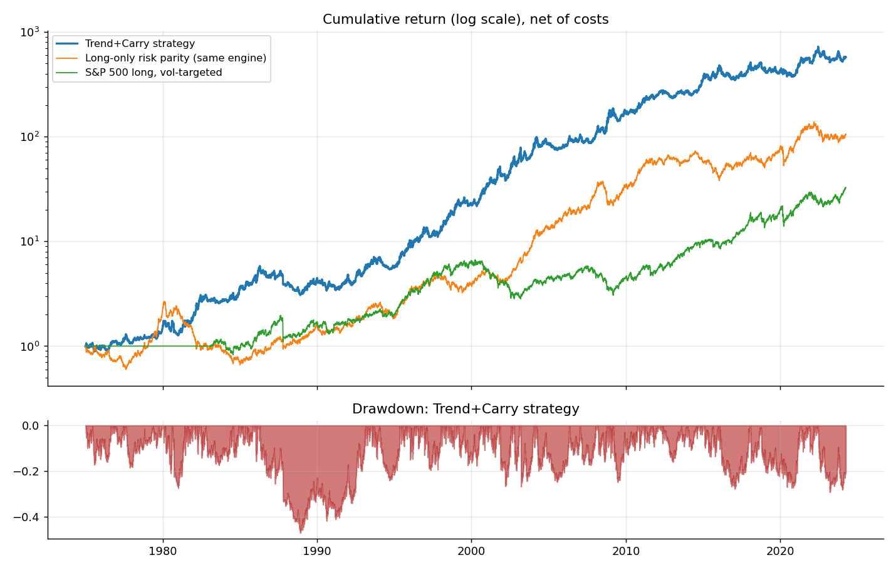
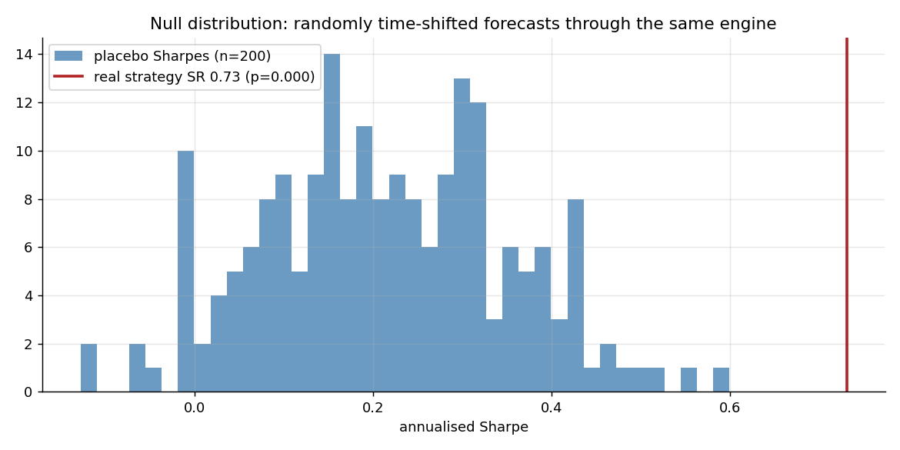
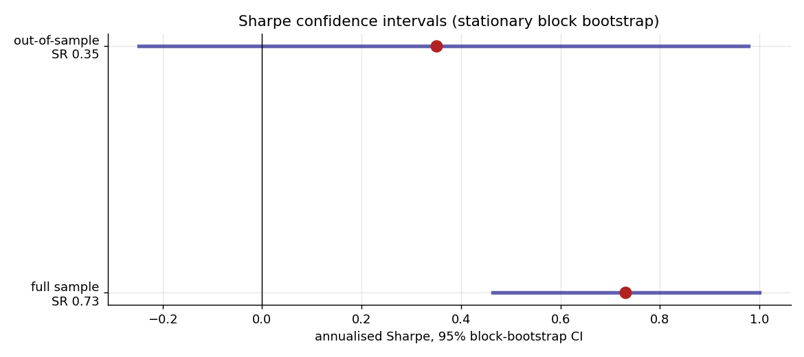
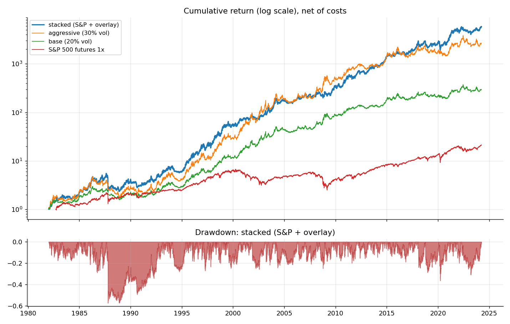
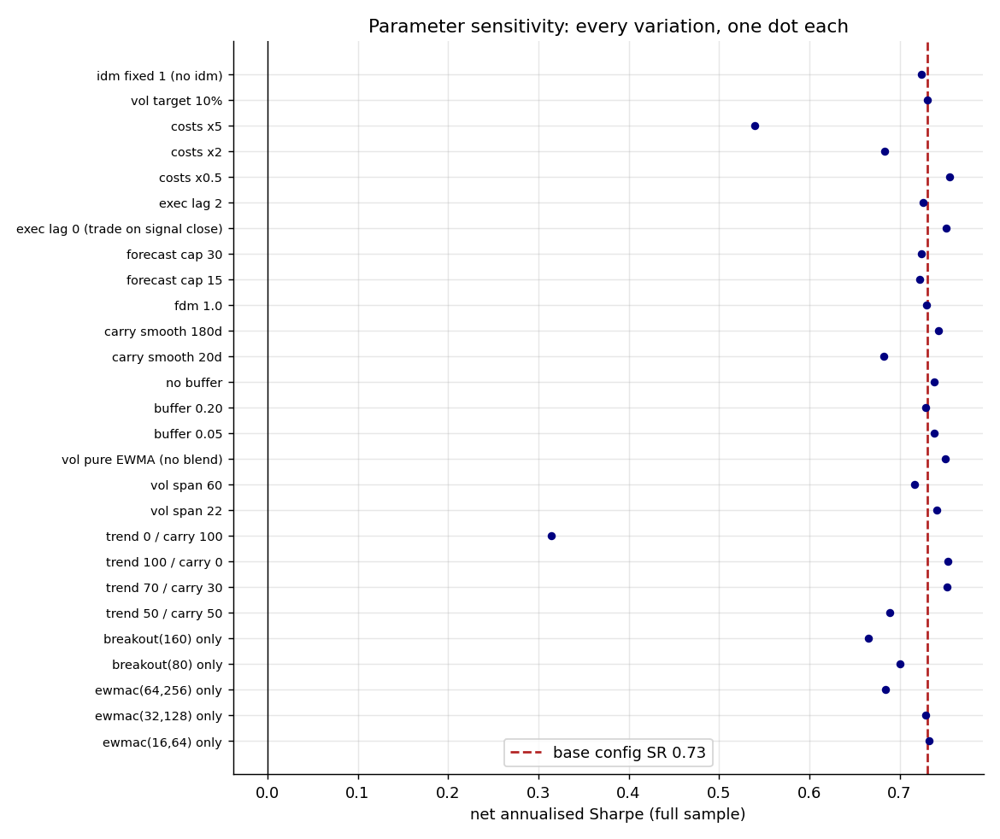
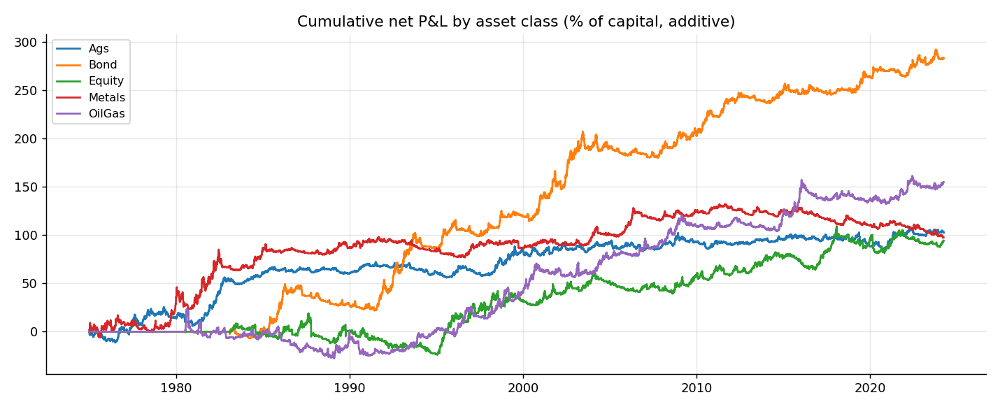
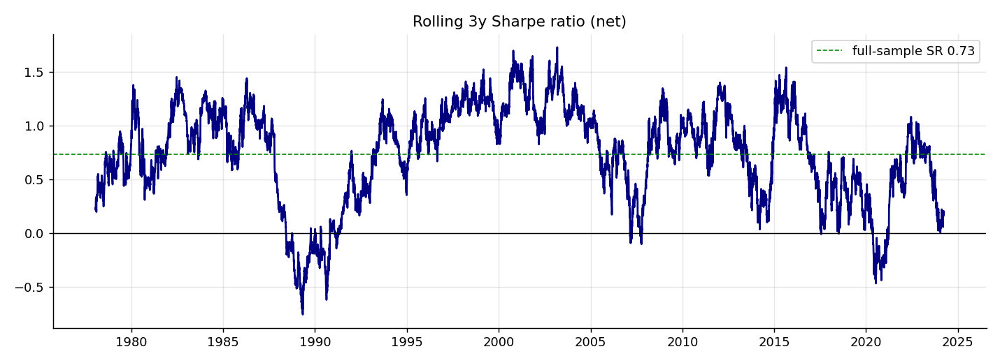
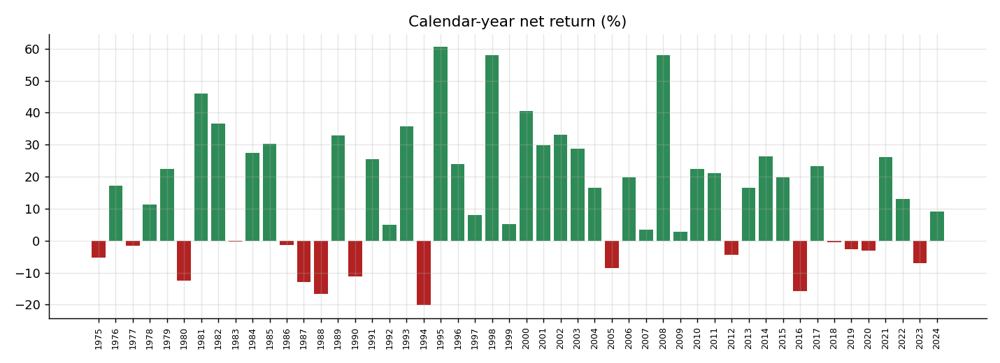

# Validation report

Generated by `scripts/run_validation.py` from the pinned data snapshot.
All returns are net of spread, commission and roll costs, with a one-day
execution lag. See README for methodology and caveats.

## Headline performance

| period | start | end | ann_return | ann_vol | sharpe | sortino | max_drawdown | skew_monthly | pct_positive_months |
|---|---|---|---|---|---|---|---|---|---|
| full sample | 1975-01-02 | 2024-03-28 | 14.0% | 19.1% | 0.73 | 0.97 | -47.3% | -0.13 | 60% |
| in-sample (≤ 2014-12-31) | 1975-01-02 | 2014-12-31 | 16.2% | 19.9% | 0.82 | 1.10 | -47.3% | -0.18 | 61% |
| out-of-sample (after) | 2015-01-01 | 2024-03-28 | 5.5% | 15.9% | 0.35 | 0.43 | -29.3% | 0.09 | 58% |

- Gross (pre-cost) full-sample Sharpe: **0.78**; cost drag 0.54%/yr trading + 0.40%/yr rolling.
- Average gross notional exposure since 1990: **4.8x** capital.

## Statistical significance

| test | full sample | out-of-sample |
|---|---|---|
| Sharpe (point) | 0.73 | 0.35 |
| 95% CI (block bootstrap, 10000 reps) | [0.46, 1.00] | [-0.25, 0.98] |
| p(SR ≤ 0), bootstrap | 0.0000 | 0.1226 |
| Probabilistic SR (non-normality adj.) | 1.0000 | 0.8778 |
| Deflated SR (33 trials, hurdle SR* = 0.18 ann.) | 1.0000 | 0.7102 |

Placebo test: 200 runs with each instrument's forecast circularly
time-shifted by a random ≥1y offset, through the identical sizing and cost engine.
Null Sharpe: mean 0.21 ± 0.14,
95th pct 0.43, max 0.60.
Real Sharpe 0.73 → **p = 0.000**.

## Benchmarks (identical engine, costs, vol target)

| benchmark | ann_return | ann_vol | sharpe | max_drawdown | corr_to_strategy |
|---|---|---|---|---|---|
| Long-only risk parity (same engine) | 10.5% | 17.9% | 0.59 | -75.4% | 0.06 |
| S&P 500 long, vol-targeted | 8.3% | 18.1% | 0.46 | -57.8% | 0.12 |

## Presets vs the S&P 500 (common window 1982–2024)

| preset | ann_return | ann_vol | sharpe | max_drawdown | oos_ann_return | oos_sharpe |
|---|---|---|---|---|---|---|
| S&P 500 futures 1x | 9.1% | 18.8% | 0.48 | -63.0% | 10.7% | 0.65 |
| base | 14.4% | 19.3% | 0.74 | -47.3% | 5.6% | 0.35 |
| aggressive | 21.5% | 29.0% | 0.74 | -63.1% | 8.3% | 0.35 |
| stacked | 22.6% | 26.5% | 0.86 | -57.2% | 14.9% | 0.69 |

Stacked-minus-S&P daily difference: **+14.6%/yr** full sample,
**+6.1%/yr** out-of-sample (2015–2024);
outperformance Sharpe 0.74,
95% CI [0.44, 1.04],
p(≤0) = 0.0000.

## Sleeves

| sleeve | ann_return | ann_vol | sharpe | max_drawdown |
|---|---|---|---|---|
| trend only | 18.0% | 23.9% | 0.75 | -42.7% |
| carry only | 6.4% | 20.3% | 0.31 | -85.9% |

Trend/carry daily return correlation: 0.26; out-of-sample Sharpe — trend 0.42, carry -0.00.

## Parameter sensitivity

Every parameter variation evaluated (each one full backtest):

| label | sharpe | sharpe_oos | ann_ret | ann_vol |
|---|---|---|---|---|
| ewmac(16,64) only | 0.73 | 0.31 | 18.9% | 25.8% |
| ewmac(32,128) only | 0.73 | 0.41 | 18.3% | 25.1% |
| ewmac(64,256) only | 0.68 | 0.48 | 17.1% | 25.0% |
| breakout(80) only | 0.70 | 0.29 | 16.5% | 23.6% |
| breakout(160) only | 0.67 | 0.47 | 15.8% | 23.7% |
| trend 50 / carry 50 | 0.69 | 0.31 | 12.8% | 18.5% |
| trend 70 / carry 30 | 0.75 | 0.38 | 15.1% | 20.0% |
| trend 100 / carry 0 | 0.75 | 0.42 | 18.0% | 23.9% |
| trend 0 / carry 100 | 0.31 | -0.00 | 6.4% | 20.3% |
| vol span 22 | 0.74 | 0.34 | 14.3% | 19.3% |
| vol span 60 | 0.72 | 0.33 | 13.6% | 19.0% |
| vol pure EWMA (no blend) | 0.75 | 0.42 | 14.8% | 19.8% |
| buffer 0.05 | 0.74 | 0.35 | 14.1% | 19.2% |
| buffer 0.20 | 0.73 | 0.36 | 13.7% | 18.9% |
| no buffer | 0.74 | 0.35 | 14.2% | 19.3% |
| carry smooth 20d | 0.68 | 0.30 | 13.1% | 19.2% |
| carry smooth 180d | 0.74 | 0.36 | 14.1% | 19.0% |
| fdm 1.0 | 0.73 | 0.36 | 11.5% | 15.7% |
| forecast cap 15 | 0.72 | 0.33 | 11.7% | 16.2% |
| forecast cap 30 | 0.72 | 0.35 | 15.7% | 21.7% |
| exec lag 0 (trade on signal close) | 0.75 | 0.36 | 14.2% | 18.9% |
| exec lag 2 | 0.73 | 0.33 | 14.0% | 19.2% |
| costs x0.5 | 0.75 | 0.37 | 14.4% | 19.1% |
| costs x2 | 0.68 | 0.32 | 13.0% | 19.1% |
| costs x5 | 0.54 | 0.21 | 10.3% | 19.1% |
| vol target 10% | 0.73 | 0.35 | 7.0% | 9.5% |
| idm fixed 1 (no idm) | 0.72 | 0.35 | 6.5% | 9.0% |

## Attribution

Annualised net return contribution and Sharpe by asset class:

| class | ann_return | sharpe |
|---|---|---|
| Ags | 3.65% | 0.53 |
| Bond | 4.94% | 0.58 |
| Equity | 1.65% | 0.20 |
| Metals | 1.64% | 0.23 |
| OilGas | 2.70% | 0.34 |

## Subperiods

| period | start | end | ann_return | ann_vol | sharpe | sortino | max_drawdown | skew_monthly | pct_positive_months |
|---|---|---|---|---|---|---|---|---|---|
| 1975-1989 | 1975-01-02 | 1989-12-29 | 11.7% | 18.9% | 0.62 | 0.82 | -47.3% | -0.37 | 57% |
| 1990-1999 | 1990-01-02 | 1999-12-31 | 18.9% | 21.7% | 0.87 | 1.24 | -24.7% | -0.20 | 64% |
| 2000-2009 | 2000-01-03 | 2009-12-31 | 21.8% | 22.7% | 0.96 | 1.32 | -26.9% | -0.08 | 62% |
| 2010-2019 | 2010-01-03 | 2019-12-31 | 8.7% | 13.7% | 0.64 | 0.83 | -27.9% | -0.07 | 62% |
| 2020-2024 | 2020-01-01 | 2024-03-28 | 7.4% | 17.1% | 0.44 | 0.52 | -29.3% | 0.25 | 59% |

