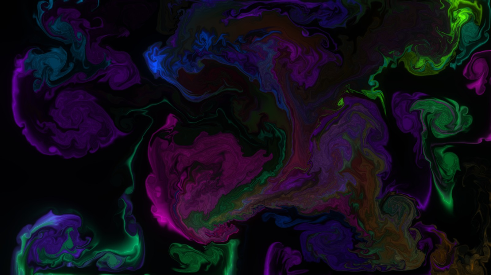

# Liquid Light — set it as your Windows live wallpaper

A real-time **GPU fluid simulation**: glowing, swirling ink with genuine
physics (incompressible Navier–Stokes — advection, vorticity, pressure
projection) and HDR **bloom** glow. Push the fluid with your mouse; it
self-stirs when idle, drifts through colour, and can pulse to your music.

## Step 1 — get the files onto your PC

On the GitHub repo page, click the green **Code** button → **Download ZIP**,
unzip it, and find the **`wallpaper`** folder. (Keep the folder together — the
wallpaper and its settings files live in it.)

## Step 2 — pick an app

### Option A · Lively Wallpaper — free, recommended
1. Install **Lively Wallpaper** (free) from the Microsoft Store, or from
   https://www.rocksdanister.github.io/lively/
2. Open Lively. Click the **＋ (Add Wallpaper)** tile.
3. Choose **Browse**, then select the **`index.html`** inside the `wallpaper`
   folder. (Lively imports and packages it for you.) — *don't* use "Create
   Wallpaper"; that's for building one from scratch.
4. It appears in your library — **click it** to set it as your wallpaper. Done!
5. Click the **⚙ / wrench** on the thumbnail to customise — see the cheat-sheet.

> **Performance note:** this runs on your GPU. It's light, but on a laptop on
> battery you can drop **Quality** to *Low* or *Medium* in the settings.

### Option B · Wallpaper Engine — if you own it on Steam
1. **Wallpaper Editor → Create Wallpaper**, choose **Web / HTML**, and point it
   at **`index.html`** in this folder (or drag the file onto the editor).
2. Apply it. The same settings appear in the wallpaper's **Properties** panel.

## Step 3 — enjoy

- **Move your mouse** across the desktop to paint and push the fluid — it swirls
  with real momentum and curls back on itself.
- It **stirs itself** with gentle fountains when you're not touching it, so it's
  always alive.
- Turn on **React to music** and play something — beats spawn bursts of colour.
- Launch a fullscreen game or video and it **pauses itself**, then resumes.

## Just want to preview it first?

Double-click `index.html` to open it in your browser (you'll need WebGL /
hardware acceleration on, which is the default). Move your mouse around.

## Settings cheat-sheet

| Setting | What it does |
|---|---|
| **Colour theme** | Spectrum · Fire · Ocean · Neon · Pastel · Mono (teal) |
| **Swirliness** | Vorticity — how much the fluid curls and spins |
| **Fade speed** | How quickly the colour dissipates (low = long-lasting trails) |
| **Brush size** | Size of the splat your cursor paints |
| **Glow (bloom)** | Strength of the luminous HDR glow |
| **Quality** | Simulation/colour resolution — lower for weaker GPUs |
| **Self-stir when idle** | Keeps it moving with no cursor |
| **React to music** | Beats spawn colour bursts (host provides system audio) |
| **3D shading** | Subtle fake-lit depth on the fluid |

## How it works (for the curious)

Each frame the GPU advects a velocity field through itself (semi-Lagrangian),
adds **vorticity confinement** to keep crisp swirls, computes divergence and
solves for pressure with ~20 Jacobi iterations, then subtracts the pressure
gradient to keep the fluid incompressible. A coloured "dye" field is advected by
that velocity and rendered with a multi-pass bloom for the glow. It's the
classic Stam *Stable Fluids* method, GPU-accelerated. ~720 lines, no libraries.
